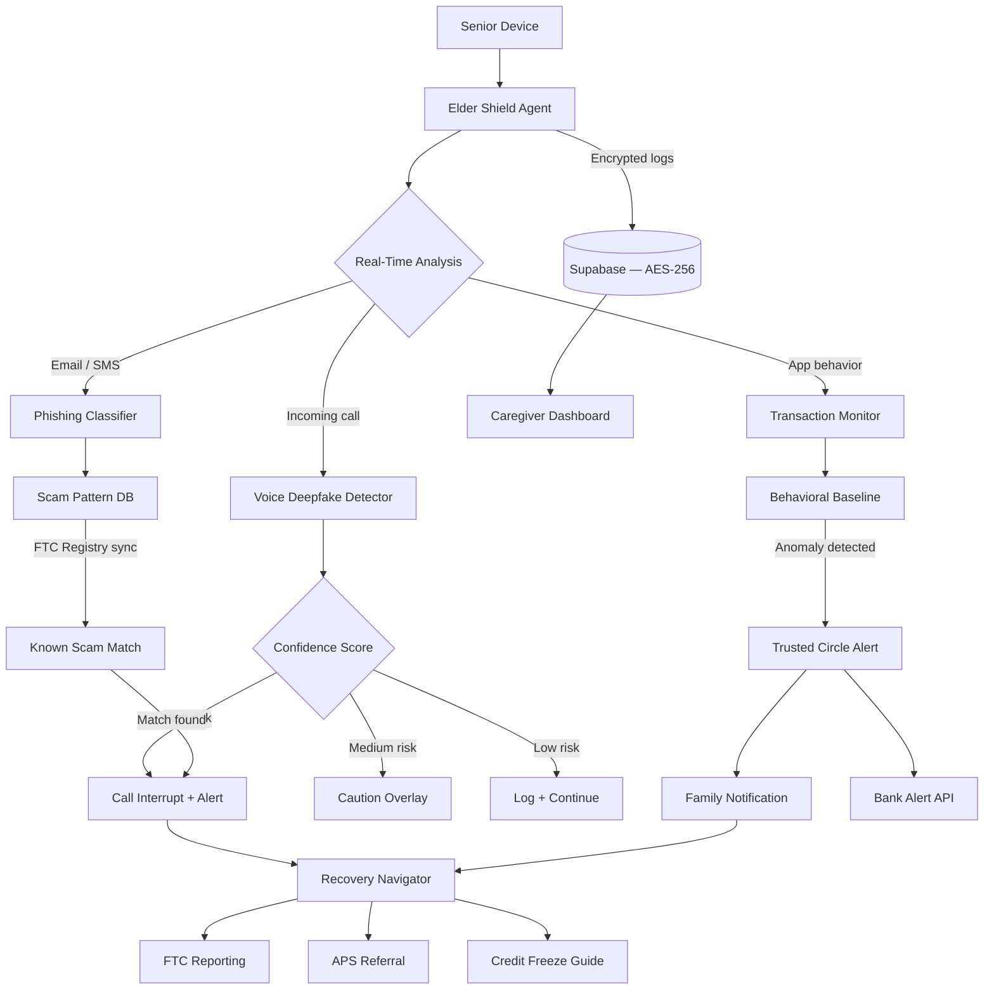

<p align="center">
  <h1 align="center">foundation-elder-shield</h1>
  <h3 align="center"><em>Protect seniors from AI-powered financial fraud. Deepfake detection. $4.9B lost annually.</em></h3>
</p>

<p align="center">
  <a href="LICENSE"></a>
  
  
  <a href="https://mama.oliwoods.ai"></a>
  <a href="https://mama.oliwoods.ai/foundation"></a>
</p>

---

> **"In 2022, older adults reported $3.1 billion in losses to the FTC — and that figure represents less than 5% of actual fraud because most victims never report."**
> — FTC Consumer Sentinel Network, 2023
>
> *The same AI tools that power creative assistants and voice synthesis are now being weaponized against the most vulnerable people in our society. We built the defense.*

## Why This Exists

- **The scale is catastrophic.** The FBI estimates elder fraud losses exceed $4.9 billion annually — a 200% increase since 2019, driven almost entirely by AI-generated deepfakes, voice clones, and personalized phishing ([FBI IC3 Elder Fraud Report, 2023](https://www.ic3.gov/))
- **AI has eliminated the "Nigerian prince" tell.** Modern fraud calls use real-time voice cloning of grandchildren, AI-written personalized emails, and deepfake video calls. Traditional fraud detection training is now obsolete
- **Victims are isolated by design.** Fraudsters deliberately target social isolation — 28% of adults 65+ live alone, and many have reduced contact with family members who could intervene ([AARP Research, 2022](https://www.aarp.org/research/))
- **Existing protections ignore the threat.** Banks flag unusual wire transfers only after the money is gone. Adult Protective Services is underfunded — APS agencies receive roughly 1 worker per 3,000 seniors nationally ([GAO Report on Elder Abuse, 2021](https://www.gao.gov/))

## What Elder Shield Does

| Capability | Description |
|---|---|
| **Deepfake Voice Detector** | Real-time analysis of phone calls for voice synthesis artifacts, prosody anomalies, and known clone signatures |
| **Scam Email/SMS Scanner** | AI-powered content analysis identifying personalized phishing, romance fraud, and grandparent scam patterns |
| **Trusted Circle** | Family and caregiver network with alert settings, spending pattern notifications, and intervention tools |
| **Transaction Guardian** | Behavioral baseline monitoring that flags anomalous transfers, gift card purchases, and wire requests |
| **Social Engineering Classifier** | Detects urgency pressure tactics, secrecy requests, and known script patterns in real-time conversation |
| **Scam Database** | Crowdsourced and FTC-integrated registry of active phone numbers, email domains, and scam scripts |
| **Recovery Navigator** | Post-fraud guidance: FTC reporting, bank fraud disputes, credit freeze steps, and APS contacts |
| **Caregiver Dashboard** | Family-facing monitoring portal with consent controls and daily summary digests |

## System Architecture



## Why This Is the Best Tool on the Market

Existing fraud protection tools were built for general populations and do not address AI-generated threats. Banks act after transactions, not before. Credit monitoring does not stop wire fraud. No commercial product provides real-time deepfake detection on phone calls for a non-technical elderly population.

**We built this to match the sophistication of the attack.**

### vs. Commercial Alternatives

| Feature | foundation-elder-shield | Commercial Alt. |
|---------|---------|-----------------|
| Price | **Free forever** | $10–30/month |
| Real-Time Deepfake Detection | **Yes** | No |
| Voice Clone Analysis | **Yes** | No |
| Trusted Circle Network | **Yes** | Limited |
| Scam Pattern DB (FTC-synced) | **Yes** | No |
| Recovery Navigator | **Yes** | No |
| Open Source | **Yes** | No |

## Research & Citations

- FBI IC3 (2023). *Elder Fraud Report 2022*. [ic3.gov](https://www.ic3.gov/Media/PDF/AnnualReport/2022_IC3ElderFraudReport.pdf)
- FTC (2023). *Consumer Sentinel Network Data Book*. [ftc.gov/reports/consumer-sentinel-network](https://www.ftc.gov/reports/consumer-sentinel-network)
- AARP Research (2022). *Loneliness and Social Connections Among Adults 65+*. [aarp.org/research](https://www.aarp.org/research/)
- GAO (2021). *Elder Abuse: Federal Coordination Could Better Support State and Local Efforts*. [gao.gov/products/gao-21-90](https://www.gao.gov/products/gao-21-90)
- Coalition Against Scam and Fraud Tactics for Seniors (CAST). *2023 Threat Landscape Report*.

## Quick Start

```bash
git clone https://github.com/OliWoods-Org/foundation-elder-shield.git
cd foundation-elder-shield
npm install
npm run dev
```

## Tech Stack

- **Runtime:** Node.js + TypeScript
- **Validation:** Zod schemas
- **Database:** Supabase (PostgreSQL, AES-256 at rest)
- **AI:** Claude API + custom deepfake voice detection models
- **Telephony:** Twilio (call interception + analysis)
- **Alerts:** SMS, email, WhatsApp to trusted circle

## Contributing

We welcome contributions from AI safety researchers, elder care professionals, and cybersecurity experts.

1. Fork the repo
2. Create a feature branch (`git checkout -b feat/your-feature`)
3. Commit your changes
4. Push and open a PR

## License

AGPL-3.0 — Free to use, modify, and distribute.

---

<p align="center">
  <strong>Built by the <a href="https://oliwoods.ai">OliWoods Foundation</a></strong><br>
  <em>Free forever. Open source. Because wisdom should be protected, not exploited.</em>
</p>
